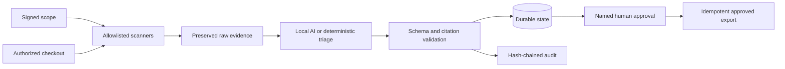

# Kleine Koe EvidenceFlow

**Sovereign OSS Assurance** for permissioned, locally processed software
security workflows.

EvidenceFlow turns supplied repository and scanner evidence into a structured,
cited assessment **without letting an LLM perform an uncontrolled side effect**.
Every result is schema-checked, every citation must resolve to supplied evidence
and publishing requires explicit human approval.

EvidenceFlow is developed as a Kleine Koe product and portfolio case for
production AI workflow engineering. The difficult part is not calling a model,
but making the complete process scoped, reliable, observable, testable and
auditable.

The repository contains a complete single-node pilot slice: explicit
repository/check authorization, local-only model policy, network-isolated
scanner execution, SARIF normalization, durable workflow state, private
evidence packs, management metrics and a loopback review console. It remains a
pilot product, not a multi-tenant platform, compliance certification or
government deployment.

## What it demonstrates

- OpenAI-compatible or fully local model adapters for Ollama, vLLM, LocalAI or
  a compatible hosted endpoint.
- Deterministic validation before and after the model call.
- Bounded transport retries and one controlled schema-repair attempt, followed
  by fail-closed behavior.
- Grounded citations whose exact quotations resolve to supplied evidence.
- Expiring repository/check scopes and local-only endpoint policy.
- Allowlisted Semgrep, Gitleaks and offline OSV execution without a shell.
- Bubblewrap network isolation for restricted external scanner processes.
- Bounded SARIF ingestion and prioritized model evidence.
- Durable SQLite state, retryable failed analysis and idempotent approved
  exports.
- Named human approval and a CSRF-protected, loopback-only review console.
- Tamper-evident JSONL audit records linked by SHA-256 hashes.
- Workflow counters, latency measurements and optional OpenTelemetry adapters.
- A synthetic golden dataset and reproducible evaluation report.

## Architecture



See [docs/architecture.md](docs/architecture.md) and
[docs/threat-model.md](docs/threat-model.md).

## Quick start

The deterministic demo and tests require Python 3.12:

```bash
PYTHONPATH=src python3 -m evidenceflow demo
PYTHONPATH=src python3 -m evidenceflow eval --dataset evals/golden.jsonl
PYTHONPATH=src pytest
```

## Run the complete permissioned pilot

Install pinned scanner binaries and download the OSV database before customer
egress is disabled:

```bash
scripts/install-scanners.sh
scripts/update-osv-database.sh
PYTHONPATH=src python3 -m evidenceflow preflight
```

Preflight does not merely locate Bubblewrap: it starts a bounded network-
isolation smoke test. Containers that deny the required user/network namespace
operations fail preflight. Do not bypass this check for restricted evidence;
use a compatible Linux host or explicitly redesign and re-review the isolation
boundary.

GitHub-hosted Actions runners currently deny that Bubblewrap network namespace.
CI therefore runs `make pilot-policy` to exercise scope, evidence processing,
validation, durable state and the approval/audit boundary using the deterministic
repository-policy check. It does **not** claim that the external scanner path
ran. The Semgrep/Gitleaks/OSV pilot remains a separate required test on a
compatible Linux host.

Run all supported local checks against the explicitly authorized example scope:

```bash
PYTHONPATH=src python3 -m evidenceflow pilot \
  --scope examples/pilot-scope.json \
  --repo . \
  --repo-id evidenceflow-ai \
  --checks repository-policy semgrep gitleaks osv \
  --offline-db .tools/osv-cache \
  --output-dir artifacts/pilot
```

The command writes preserved scanner output, execution receipts, a bounded
evidence case, a validated assessment, pilot metrics, a management summary, a
hash-chained audit log and a private evidence pack. It deliberately stops in
`pending_approval`.

Review from the CLI or start the local console:

```bash
PYTHONPATH=src python3 -m evidenceflow status \
  --state-db artifacts/pilot/workflow.db

PYTHONPATH=src python3 -m evidenceflow serve \
  --state-db artifacts/pilot/workflow.db \
  --audit artifacts/pilot/audit.jsonl \
  --approved-dir artifacts/pilot/approved
```

The dashboard refuses non-loopback binds. Approval and export are separate,
named and audited state transitions.

## Use a local model

Restricted scopes accept loopback endpoints only:

```bash
export EVIDENCEFLOW_BASE_URL=http://127.0.0.1:11434/v1
export EVIDENCEFLOW_MODEL=qwen3.6:35b-a3b
export EVIDENCEFLOW_API_KEY=local
export EVIDENCEFLOW_TIMEOUT_SECONDS=180
export EVIDENCEFLOW_MAX_TOKENS=4096
PYTHONPATH=src python3 -m evidenceflow pilot \
  --scope examples/pilot-scope.json \
  --repo . \
  --repo-id evidenceflow-ai \
  --checks repository-policy semgrep \
  --output-dir artifacts/local-model-pilot
```

Local Qwen development runs processed five deterministic observations and
returned five exact citations. Observed model latency ranged from about 58 to
104 seconds. The final guarded repair-path run took approximately 104 seconds
and returned a low-risk assessment; an earlier input/run returned medium risk.
Timeout, truncated-reasoning and prohibited-assurance responses were rejected
fail-closed. These runs prove the integration and safety path, not model
accuracy, stability or capacity.

## Evaluation contract

`evals/golden.jsonl` contains synthetic cases only. It measures risk-label
accuracy, citation validity, invalid-output rejection, approval safety and
duplicate-publish prevention. It is an executable regression contract, not an
enterprise benchmark.

## Product and commercial material

- [Product discovery](docs/product-discovery.md)
- [Pilot offer and pitch](docs/pilot-offer-and-pitch.md)
- [Commercial one-pager](docs/commercial/one-pager.md)
- [Pilot runbook](docs/operations/pilot-runbook.md)
- [Independent reviewer and learning handoff](docs/fable-handoff.md)
- [CV case study](docs/cv-case-study.md)
- [Landing-page draft](site/sovereign-oss-assurance.html)

## Recruiter-ready statement

> Built a scope-enforced, approval-gated local AI assurance workflow with
> network-isolated scanner orchestration, SARIF normalization, grounded
> citations, durable state, idempotent exports, a loopback review console,
> tamper-evident auditing, OpenTelemetry hooks and regression evaluations.

Only add customer, repository-count, accuracy, uptime or time-saved claims after
they have actually been measured and approved for disclosure.

## Commercial and security boundaries

The price bands and templates in `docs/commercial/` are proposal material, not
accepted customer contracts. Templates require legal, insurance, tax and
procurement review. See [SECURITY.md](SECURITY.md) for private vulnerability
reporting.

Kleine Koe: https://kleinekoe.nl
