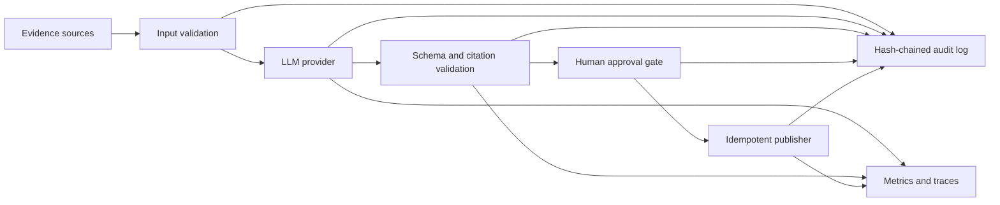

# EvidenceFlow AI

EvidenceFlow is a privacy-first reference workflow for turning operational
evidence into a structured, cited assessment **without letting an LLM perform
an uncontrolled side effect**. Every result is schema-checked, every citation
must resolve to supplied evidence, and publishing requires explicit human
approval.

It is a portfolio case for production AI workflow engineering: the difficult
part is not calling a model, but making the complete process reliable,
observable, testable, and auditable.

## What it demonstrates

- OpenAI-compatible or fully local model adapters (Ollama, vLLM, LocalAI, or a
  hosted compatible endpoint).
- Deterministic validation before and after the model call.
- Bounded transport retries plus one controlled schema-repair attempt, followed
  by fail-closed behavior for malformed model output.
- Grounded citations: quoted text must exist in the referenced source.
- Idempotency: reprocessing the same case cannot duplicate the final action.
- Human approval before the publisher is called.
- Tamper-evident JSONL audit records linked by SHA-256 hashes.
- Workflow counters and latency measurements, with an optional OpenTelemetry
  adapter that uses the application's configured meter and tracer providers.
- A synthetic golden dataset and reproducible evaluation report.

## Architecture



See [docs/architecture.md](docs/architecture.md) for failure boundaries and
design trade-offs.

## Quick start

The deterministic demo and tests require only Python 3.12:

```bash
cd evidenceflow-ai
PYTHONPATH=src python3 -m evidenceflow demo
PYTHONPATH=src python3 -m evidenceflow eval --dataset evals/golden.jsonl
PYTHONPATH=src pytest
```

The demo intentionally pauses before publishing, then records a named approval
and publishes exactly once. Its audit trail is written under `artifacts/`.

## Use an OpenAI-compatible local endpoint

```bash
export EVIDENCEFLOW_BASE_URL=http://127.0.0.1:11434/v1
export EVIDENCEFLOW_MODEL=qwen3:8b
export EVIDENCEFLOW_API_KEY=local
PYTHONPATH=src python3 -m evidenceflow analyze examples/incident.json
```

The provider requests JSON and validates the response locally. Model output is
never trusted merely because it is valid JSON.

### Verified local adapter

The OpenAI-compatible adapter was smoke-tested against local Ollama with
`qwen2.5-coder:7b`. The first loose-schema response was rejected fail-closed.
After tightening the contract and adding one bounded schema-repair attempt, the
model produced a valid assessment whose citation resolved exactly in the
supplied synthetic evidence. This proves transport, schema validation, repair,
and grounding behavior; it is not an accuracy benchmark for the model.

## Evaluation contract

`evals/golden.jsonl` contains synthetic cases only. The evaluation measures:

- risk-label accuracy;
- citation validity;
- invalid-output rejection;
- approval-gate safety;
- duplicate-publish prevention.

Run `python3 -m evidenceflow eval` to create `artifacts/eval-report.json`. The
repository does not claim enterprise accuracy from a tiny synthetic dataset;
the dataset is an executable regression contract, not a marketing benchmark.

## Recruiter-ready project statement

> Built an approval-gated AI evidence-triage workflow with local/OpenAI-
> compatible inference, grounded citations, bounded retries, idempotent side
> effects, tamper-evident auditing, OpenTelemetry hooks, and regression evals.

Use that wording only after understanding the design and being able to explain
the tests and trade-offs. Replace it with measured numbers from the generated
evaluation report once the project is published.
