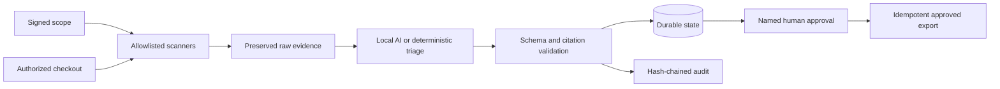

# Kleine Koe EvidenceFlow

**In one minute.** EvidenceFlow is a small open-source tool I built to make
AI-assisted review work checkable. It takes the evidence for a software
security review (scanner results, code, quotes), lets a locally running AI
model *organise* that evidence but never invent it, and refuses to publish
anything until a named person has looked at it and approved it. Every step
leaves a record you can verify afterwards. It is a working pilot with an
automated test suite, not a finished product.

**Why the name.** It is literal: evidence flows through the tool. Findings
and code go in, every claim the model makes has to point back to something
that went in, and what comes out is an approved report with an audit trail
of who decided what. Nothing is claimed that cannot be traced to its
evidence. That habit — say nothing you cannot point to — is also how the
two experiments further down were run.

**What is in this repository.**

1. The workflow itself, runnable on one machine, with its tests
   (sections "Quick start" onwards).
2. Two experiments from August 2026 in which I tested whether a method
   works, with the pass/fail criteria written down before the runs
   (section "Two experiments"):
   - **Can a small vision model learn to tell damage types apart from
     photos?** Yes. After fine-tuning on 1,610 labelled photos it scored
     macro-F1 0.76 on 460 photos it had never seen, against 0.52 before
     fine-tuning. It also knows when it is unsure: if it only answers the
     70% of photos it is most confident about, it is right 87% of the time.
   - **Can a photo be turned into millimetre measurements?** The code chain
     works: camera calibration, lens correction and a reference pattern
     give a median error of 0.08% on test images with known answers. The
     real-camera check is the written-down next step.

Each experiment folder has a README that says what it shows, what it does
not show, and how to check it yourself. Dates, hashes and versions are
recorded and have not been adjusted.

## What the pilot contains

The repository contains a complete single-node pilot slice: explicit
repository/check authorization, local-only model policy, network-isolated
scanner execution, SARIF normalization, durable workflow state, private
evidence packs, management metrics and a loopback review console. It remains a
pilot product, not a multi-tenant platform, compliance certification or
government deployment.

## Feature list (technical)

- OpenAI-compatible or fully local model adapters for Ollama, vLLM, LocalAI or
  a compatible hosted endpoint.
- Deterministic validation before and after the model call.
- Bounded transport retries and one controlled schema-repair attempt, followed
  by fail-closed behavior.
- Grounded citations whose exact quotations resolve to supplied evidence.
- Expiring repository/check scopes and local-only endpoint policy.
- Allowlisted Semgrep, Gitleaks and offline OSV execution without a shell.
- Bubblewrap network isolation for restricted external scanner processes.
- Bounded SARIF ingestion and prioritized model evidence.
- Durable SQLite state, retryable failed analysis and idempotent approved
  exports.
- Named human approval and a CSRF-protected, loopback-only review console.
- Tamper-evident JSONL audit records linked by SHA-256 hashes.
- Workflow counters, latency measurements and optional OpenTelemetry adapters.
- A synthetic golden dataset and reproducible evaluation report.
- A vision fine-tuning experiment with criteria fixed in advance: zero-shot baseline vs
  LoRA fine-tune of a vision-language model on a labeled image dataset,
  evaluated on a frozen held-out test split with a fresh-process repeat
  (macro-F1 0.52 -> 0.76), plus a measured abstention/risk-coverage
  analysis on images (see [Demonstrators](#demonstrators)).
- A calibrated measurement experiment with criteria fixed in advance: camera calibration,
  distortion correction, plane homography and pixel-to-millimetre
  measurement validated end-to-end against synthetic ground truth
  (median error 0.08%; see [Demonstrators](#demonstrators)).

## Architecture



See [docs/architecture.md](docs/architecture.md) and
[docs/threat-model.md](docs/threat-model.md).

## Quick start

The deterministic demo and tests require Python 3.12:

```bash
PYTHONPATH=src python3 -m evidenceflow demo
PYTHONPATH=src python3 -m evidenceflow eval --dataset evals/golden.jsonl
PYTHONPATH=src pytest
```

## Run the complete permissioned pilot

Install pinned scanner binaries and download the OSV database before customer
egress is disabled:

```bash
scripts/install-scanners.sh
scripts/update-osv-database.sh
PYTHONPATH=src python3 -m evidenceflow preflight
```

Preflight does not merely locate Bubblewrap: it starts a bounded network-
isolation smoke test. Containers that deny the required user/network namespace
operations fail preflight. Do not bypass this check for restricted evidence;
use a compatible Linux host or explicitly redesign and re-review the isolation
boundary.

GitHub-hosted Actions runners currently deny that Bubblewrap network namespace.
CI therefore runs `make pilot-policy` to exercise scope, evidence processing,
validation, durable state and the approval/audit boundary using the deterministic
repository-policy check. It does **not** claim that the external scanner path
ran. The Semgrep/Gitleaks/OSV pilot remains a separate required test on a
compatible Linux host.

Run all supported local checks against the explicitly authorized example scope:

```bash
PYTHONPATH=src python3 -m evidenceflow pilot \
  --scope examples/pilot-scope.json \
  --repo . \
  --repo-id evidenceflow-ai \
  --checks repository-policy semgrep gitleaks osv \
  --offline-db .tools/osv-cache \
  --output-dir artifacts/pilot
```

The command writes preserved scanner output, execution receipts, a bounded
evidence case, a validated assessment, pilot metrics, a management summary, a
hash-chained audit log and a private evidence pack. It deliberately stops in
`pending_approval`.

Review from the CLI or start the local console:

```bash
PYTHONPATH=src python3 -m evidenceflow status \
  --state-db artifacts/pilot/workflow.db

PYTHONPATH=src python3 -m evidenceflow serve \
  --state-db artifacts/pilot/workflow.db \
  --audit artifacts/pilot/audit.jsonl \
  --approved-dir artifacts/pilot/approved
```

The dashboard refuses non-loopback binds. Approval and export are separate,
named and audited state transitions.

## Use a local model

Restricted scopes accept loopback endpoints only:

```bash
export EVIDENCEFLOW_BASE_URL=http://127.0.0.1:11434/v1
export EVIDENCEFLOW_MODEL=qwen3.6:35b-a3b
export EVIDENCEFLOW_API_KEY=local
export EVIDENCEFLOW_TIMEOUT_SECONDS=180
export EVIDENCEFLOW_MAX_TOKENS=4096
PYTHONPATH=src python3 -m evidenceflow pilot \
  --scope examples/pilot-scope.json \
  --repo . \
  --repo-id evidenceflow-ai \
  --checks repository-policy semgrep \
  --output-dir artifacts/local-model-pilot
```

Local Qwen development runs processed five deterministic observations and
returned five exact citations. Observed model latency ranged from about 58 to
104 seconds. The final guarded repair-path run took approximately 104 seconds
and returned a low-risk assessment; an earlier input/run returned medium risk.
Timeout, truncated-reasoning and prohibited-assurance responses were rejected
fail-closed. These runs prove the integration and safety path, not model
accuracy, stability or capacity.

## Evaluation contract

`evals/golden.jsonl` contains synthetic cases only. It measures risk-label
accuracy, citation validity, invalid-output rejection, approval safety and
duplicate-publish prevention. It is an executable regression contract, not an
enterprise benchmark.

## Product and commercial material

The current market-test entry offer is a €950, two-working-day evidence
discovery. Larger bands in the commercial documents are clearly labelled
future enterprise hypotheses; they are not validated prices or first-contact
offers.

- [Product discovery](docs/product-discovery.md)
- [Pilot offer and pitch](docs/pilot-offer-and-pitch.md)
- [Commercial one-pager](docs/commercial/one-pager.md)
- [Pilot runbook](docs/operations/pilot-runbook.md)
- [Independent reviewer and learning handoff](docs/fable-handoff.md)
- [CV case study](docs/cv-case-study.md)
- [Landing-page draft](site/sovereign-oss-assurance.html)

## Two experiments

Both were done in August 2026 to find out whether two methods actually work.
In both cases the acceptance
criteria, the fixed configuration and the scripts were written down before
the first run, and the results were added afterwards without touching the
criteria; each README keeps the original pre-registration section intact
above the results. The point is simple: decide what "good enough" means
before you see the numbers.

### 1. Teaching a vision model to recognise damage types

Folder: [`demonstrators/vision-lora-car-damage/`](demonstrators/vision-lora-car-damage/)

- **Question.** Can a small open vision-language model (Qwen2.5-VL, 3B
  parameters) learn to classify photos of damage after a short fine-tune
  on my own AMD hardware, and by how much does it beat the same model
  untrained?
- **Setup.** 2,300 labelled car-damage photos (public, MIT licence), split
  once into train / validation / test with every file hashed. The model
  first answers untrained (the baseline), then after a LoRA fine-tune on
  the 1,610 training photos. Both are scored on the same 460 test photos
  it never saw. Evaluation repeated in a fresh process.
- **Result.** Accuracy 63% → 77%; macro-F1 0.52 → 0.76 (the pass mark was
  +0.10). The untrained model almost never recognised "crushed" damage
  (7% and 2% recall); after fine-tuning 70% and 53%. The repeat run gave
  byte-identical results.
- **Knowing when to ask a human.** If the model is allowed to skip the
  photos it is least sure about, it gets better on the rest: 81% right
  when it answers 90% of photos, 87% at 70%, 93% at 50%. The photos it
  skips are genuinely harder (41–62% right). Its confidence also became
  more honest after fine-tuning (calibration error 0.095 → 0.049). This is
  the image version of the "abstain and escalate" rule the workflow above
  is built on.
- **What this does not show.** Results on any other kind of photo,
  production readiness, or a guaranteed confidence. One training run, one
  seed. Car damage was chosen because it is public and labelled, not
  because it is the end use.
- **Check it yourself.** `cd demonstrators/vision-lora-car-damage && sha256sum -c manifest.sha256`,
  then `python scripts/04_report.py …` regenerates every number from the
  committed per-photo predictions. Training and evaluation commands are
  in the README.

### 2. Measuring millimetres from a photo

Folder: [`demonstrators/camera-calibration-planar-mm/`](demonstrators/camera-calibration-planar-mm/)

- **Question.** Can a photo of an object next to a printed reference
  pattern be turned into a real-world length, and how accurately?
- **Setup.** The full chain — camera calibration from a chessboard, lens
  distortion correction, mapping the reference plane to millimetres,
  measuring the distance between two points — run on images generated
  with a simulated camera whose properties and true distances are known
  exactly. That makes every error measurable.
- **Result.** The calibration recovered the simulated camera to within
  0.16%; the measured 60.000 mm distance came out with a median error of
  0.08% (worst case 0.28%) over 12 images at two distances and three
  angles. Rerunning gives identical numbers.
- **What this does not show.** A real camera, print or caliper. It proves
  the code chain is right; the physical check — with its acceptance
  criteria already written down in the README — is the next step, and
  measuring from uncontrolled consumer photos is a separate, open problem.
- **Check it yourself.** `cd demonstrators/camera-calibration-planar-mm && sha256sum -c manifest.sha256`;
  the whole thing regenerates from `scripts/synth_generate.py`.

## How this was built

- Both experiments ran on my own workstation (AMD Ryzen AI MAX+ 395 with a
  Radeon 8060S) in August 2026, in a pinned container whose digest is
  recorded in each folder's `versions.txt`.
- No dates were changed. Author times, commit times and GitHub's push
  records are as they happened.
- They follow the same working habit as everything else I publish:
  dated, hashed, reproducible runs with repeat checks, pinned versions,
  negative results kept in, and an explicit line about what a result does
  not prove.

## Recruiter-ready statement

> Built a scope-enforced, approval-gated local AI assurance workflow with
> network-isolated scanner orchestration, SARIF normalization, grounded
> citations, durable state, idempotent exports, a loopback review console,
> tamper-evident auditing, OpenTelemetry hooks and regression evaluations.

Only add customer, repository-count, accuracy, uptime or time-saved claims after
they have actually been measured and approved for disclosure.

## Commercial and security boundaries

The price bands and templates in `docs/commercial/` are proposal material, not
accepted customer contracts. Templates require legal, insurance, tax and
procurement review. See [SECURITY.md](SECURITY.md) for private vulnerability
reporting.

Kleine Koe: https://kleinekoe.nl
