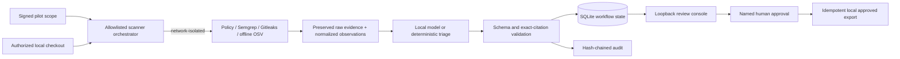

# Architecture and operating model

## Kleine Koe pilot topology

EvidenceFlow is deliberately split into two authority levels. Scanner and model
components may propose evidence and classification. Only the workflow state
machine can accept a named approval and only the publisher can create a handoff.

External scanners receive fixed argument lists rather than a shell command.
Restricted pilot runs require Bubblewrap and unshare their network namespace.
The local model endpoint is checked separately and must resolve from a loopback
URL under `deny` or `local-only` scope.

## Trust boundaries

The workflow treats both evidence and model output as untrusted input.

1. Input validation rejects missing identifiers, empty sources, duplicate
   source identifiers, and oversized evidence before any model call.
2. The provider returns a structured assessment, but the workflow reconstructs
   domain objects and validates them independently.
3. A citation is accepted only when its source exists and its exact quotation
   is present in that source.
4. No publisher receives data before a named reviewer approves the case.
5. The publisher receives a stable idempotency key derived from the case and
   assessment. Replaying the same workflow cannot repeat the side effect.

## Failure behavior

| Failure | Behavior | Audit event |
|---|---|---|
| invalid evidence | reject before model call | `input_rejected` |
| provider timeout/transient error | bounded exponential retry | `provider_retry` |
| malformed model response | one schema-repair attempt, then fail closed | `analysis_failed` |
| unverifiable citation | fail closed | `analysis_failed` |
| approval missing | publisher is not called | `publish_blocked` |
| duplicate publish | return prior receipt | `publish_deduplicated` |

## Observability

The core telemetry interface records counters and durations without requiring
an observability backend. Installing the `telemetry` extra enables
`OpenTelemetryTelemetry`, which uses the application's configured meter and
tracer providers. Useful production service-level indicators include:

- workflow completion and failure rate;
- provider latency and retry rate;
- invalid response and citation rejection rate;
- time waiting for approval;
- publish success and deduplication rate.

No prompt or raw evidence is emitted as a metric attribute.

## Deployment path

The reference implementation is deliberately transport-agnostic. SQLite and the
stdlib loopback dashboard provide a durable single-node pilot. A production
rollout should replace them with authenticated identity/RBAC, PostgreSQL or a
durable workflow engine, protected object storage, signed append-only audit
receipts, a queue/dead-letter strategy and customer-approved ticketing or
Forgejo connectors. The in-memory adapters remain for tests and the minimal
demonstration.

## Artifact contract

Each pilot repository produces:

- preserved scanner SARIF and execution receipts;
- normalized `raw-scan.json`;
- bounded `evidence-case.json` sent to triage;
- validated `assessment.json`;
- private `evidence-pack.md`;
- `metrics.json` and `management-summary.md`;
- durable workflow state and the shared audit chain;
- an approved export only after the state transition is authorized.
